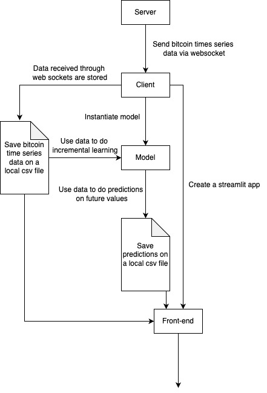

The goal of this project was to create the most simple architecture to do online learning.  
It means that the model will be trained each time he gained new data.  
There was several ideas to online learning:
- train the model only on the last row it received
- train the model on all the data accumulated so far  

Because our database had very few rows i decided to go for the second option

server.py is the server, it send via websocket data to the client (client.py)  

client.py store the data received in a local file located at data/real_time/datas.csv  

client.py instantiate a model and trained it on data received (data/real_time/datas.csv).  

Then client.py predict the futures values and store them on data/real_time/predictions.csv  
To predict the futures values, it uses a function from the script dataset.py that allows to extend the dataset rows using models's predictions as future y (extend_data_with_1_step)  

In the same time client.py launch via subprocess a streamlit app (streamlit_realtime_prediction.py)  
The streamlit app print the 2 csv files in a plotly graph

To run the code you need just need to do:
1) python server.py
2) python client.py